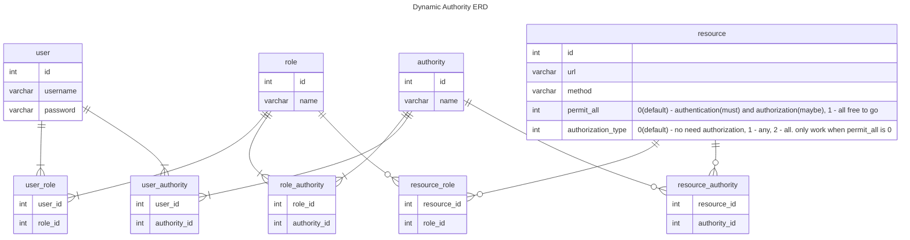

## Dynamic Authority ERD

## Assumption

Each endpoint in each controller will be annotated with http request method.

Each endpoint will be identified by a path and a request method.

## Steps

After the application started, a database called `dynamic_authority` will be created and all endpoints information will
be stored in this database.