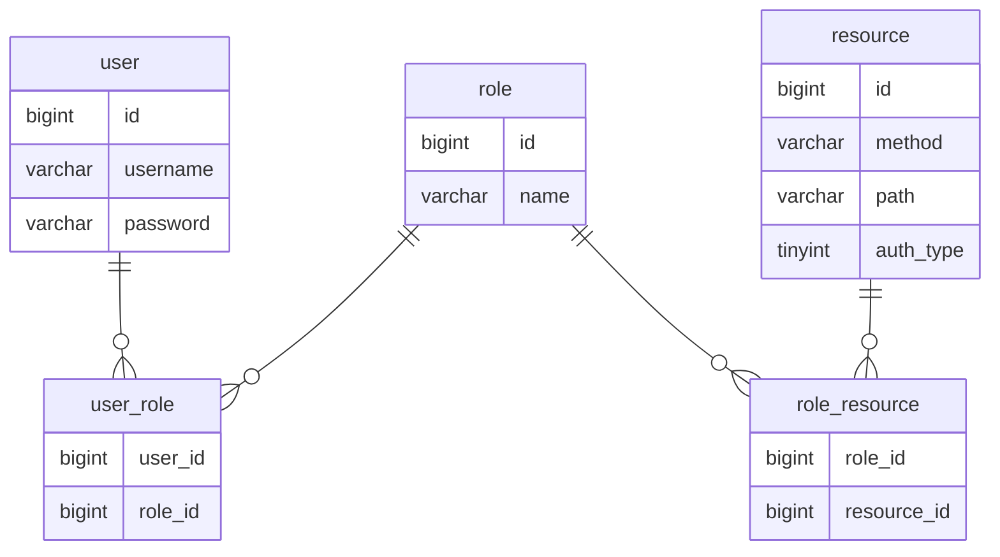

```mermaid
erDiagram
    user {
        bigint id
        varchar username
        varchar password
    }

    user ||--o{ user_role : ""

    user_role {
        bigint user_id
        bigint role_id
    }

    role ||--o{ user_role : ""

    role {
        bigint id
        varchar name
    }

    role ||--o{ role_resource : ""

    role_resource {
        bigint role_id
        bigint resource_id
    }

    resource ||--o{ role_resource : ""

    resource {
        bigint id
        varchar method
        varchar path
        tinyint auth_type
    }
```